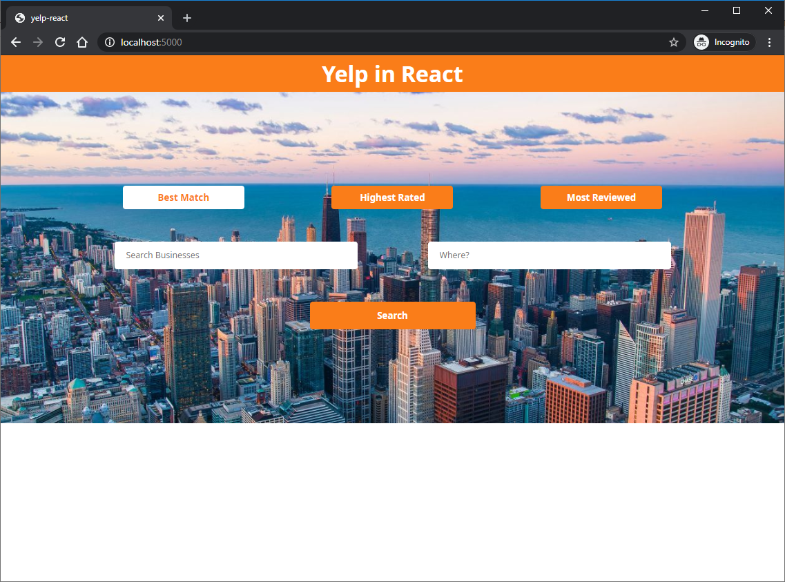
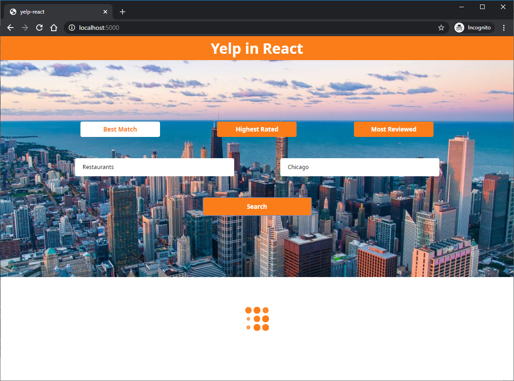
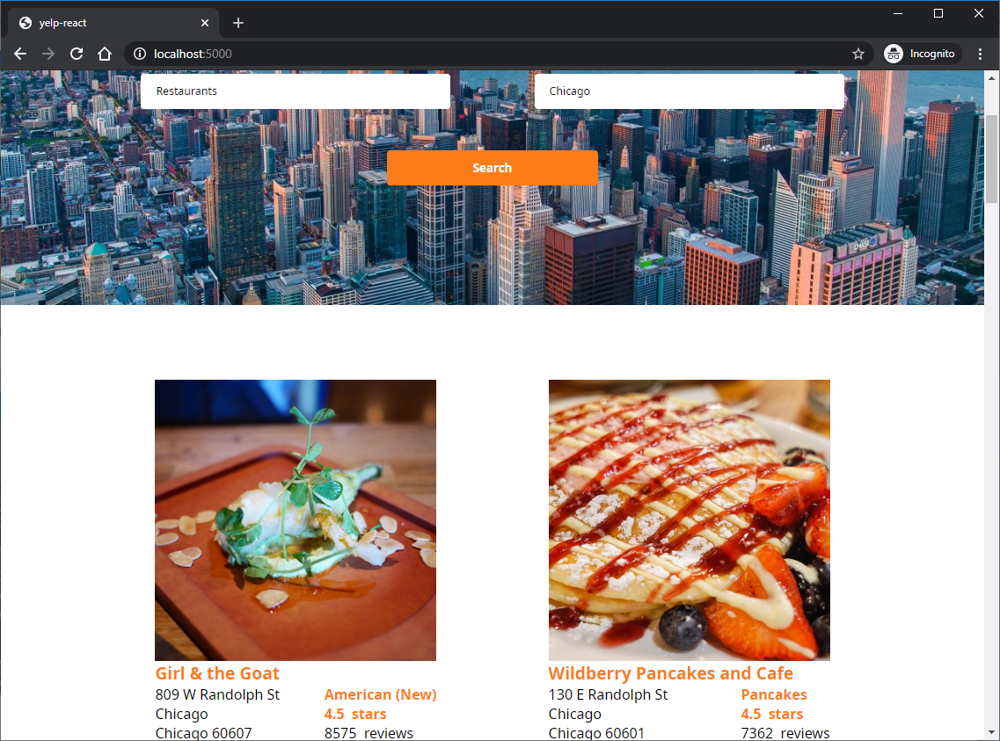
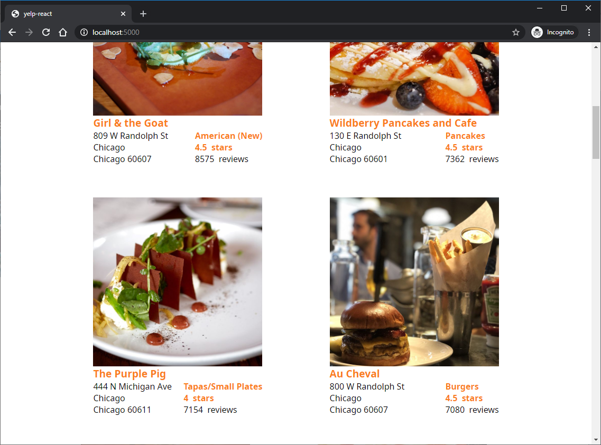
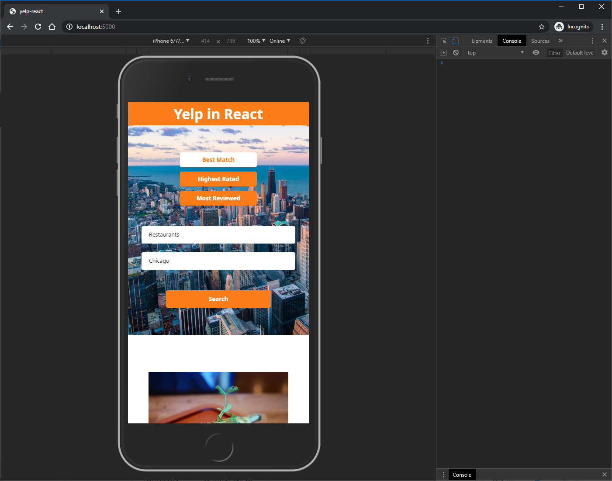

# yelp-react
Create yelp clone using React.

## Table of contents
* [General info](#general-info)
* [Technologies](#technologies)
* [Features](#features)
* [Screenshots](#screenshots)
* [Setup](#setup)
* [Status](#status)
* [License](#license)

## General info
Goal of project is to create simple React page using react class components without additional state management libraries. Use new project starter - Neutrino. Use eslint with airbnb rules.

## Technologies
* [React](https://reactjs.org/)
* [Styled components](https://styled-components.com/)
* [Neutrino](https://neutrinojs.org/)
* [Eslint](https://eslint.org/)

## Features
* Use Neutrino as project starter
* Use external yelp API to find businesses
* Show items list
* Infinite scroll

## Screenshots

## Setup
How to run this project.

1. Clone this repo

2. To run, go to project folder and run

`$ yarn`

3. Create your own YELP API KEY

Follow [the instruction](https://www.yelp.com/developers/documentation/v3/authentication)

4. Paste api key into src/Config/Config.js

5. Now start dev server by running -

`$ yarn start`

6. visit - http://localhost:5000/

To create production ready codes -

`$ npm run build`

for more commands refer `package.json`

## Status
Project is finished.

## Photos
* [Source](https://unsplash.com)
* [License](https://unsplash.com/license)

## License
MIT
